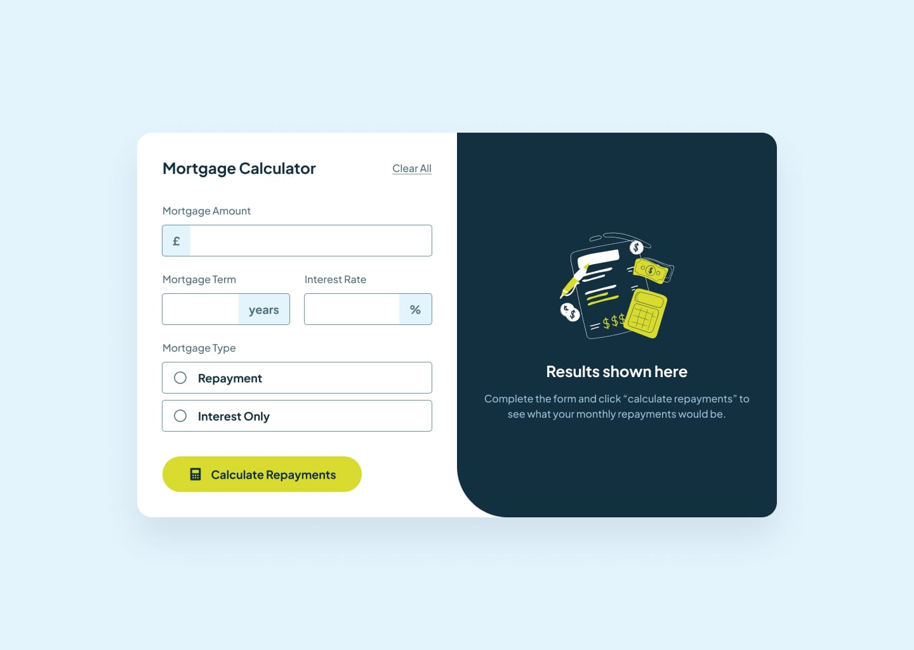
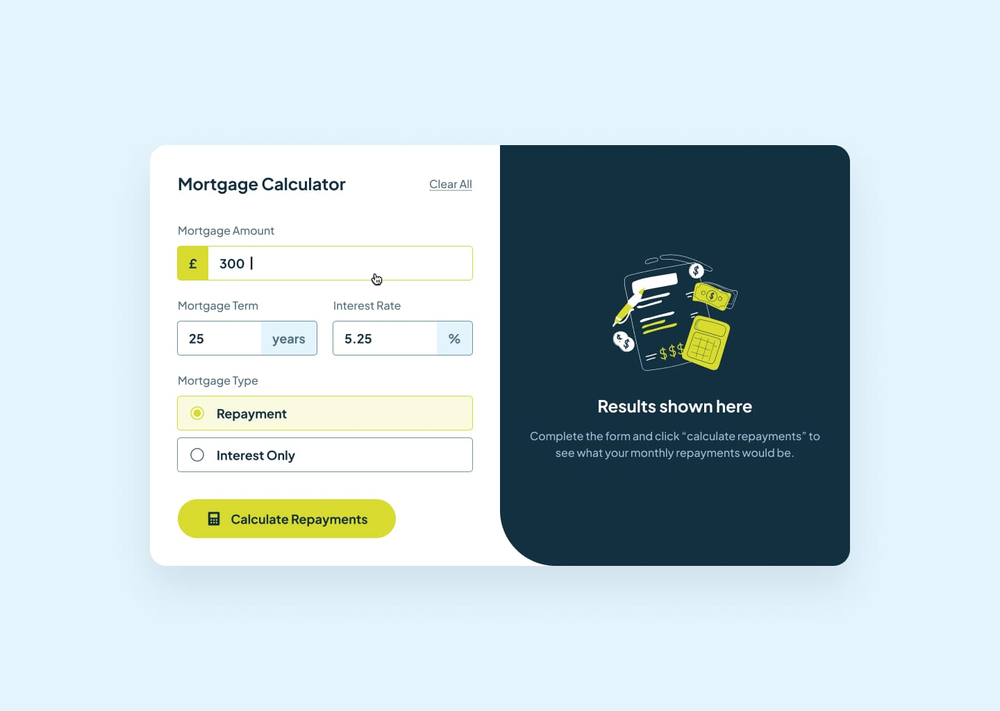
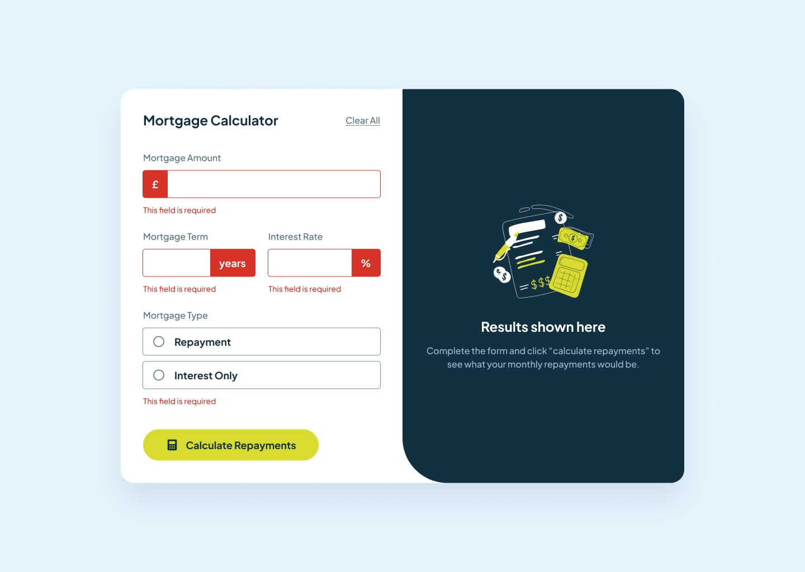
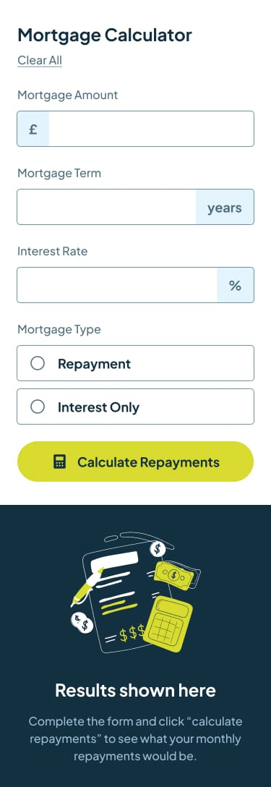
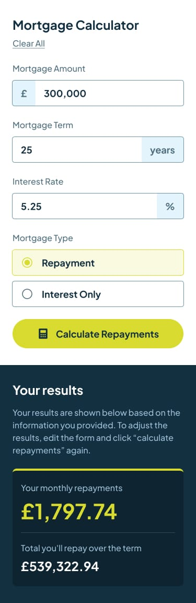

# Frontend Mentor - Mortgage Repayment Calculator Solution

This is my solution to the **Mortgage Repayment Calculator** challenge on Frontend Mentor. This project focuses on building a fully responsive mortgage calculator application using semantic HTML, modern CSS, and vanilla JavaScript.

The challenge was a great opportunity to practice responsive layouts, form validation, DOM manipulation, financial calculations, accessibility improvements, custom form controls, and scalable frontend architecture without using frameworks or external libraries.

---

## Table of contents

* [Overview](#overview)
* [The challenge](#the-challenge)
* [Design](#design)
* [Links](#links)
* [My process](#my-process)
* [Built with](#built-with)
* [What I learned](#what-i-learned)

---

## Overview

This project is a responsive mortgage repayment calculator that allows users to calculate monthly repayments and total repayment amounts based on mortgage amount, term length, interest rate, and mortgage type.

The application supports two mortgage types:

* Repayment Mortgage
* Interest Only Mortgage

The interface dynamically validates user inputs, displays error states, and updates calculation results instantly using JavaScript and DOM manipulation.

The layout is fully responsive and adapts smoothly across desktop, tablet, and mobile devices.

All styling was built using modern CSS techniques such as Flexbox, CSS custom properties, pseudo-elements, media queries, and advanced selectors like `:has()`. Interactivity was implemented using vanilla JavaScript with event-driven programming and financial calculation formulas.

---

## The challenge

Users should be able to:

* View the optimal layout depending on their device’s screen size.
* Calculate mortgage repayments dynamically.
* Select between repayment and interest-only mortgage types.
* See validation messages for empty or invalid fields.
* View hover and focus states for interactive elements.
* Navigate the interface using keyboard interactions.
* Experience smooth scrolling behavior on mobile devices.
* Interact with custom styled radio buttons.
* View responsive layouts across desktop and mobile devices.

---

## Design

* Desktop Design

* Desktop Design completed

* Active States

* Error States

* Mobile Design

* Mobile Design completed

---

## Links

* Solution URL: [GitHub Repository](https://github.com/mlopezl/mortgage-repayment-calculator-main)
* Live Site URL: [Live Demo](https://mlopezl.github.io/mortgage-repayment-calculator-main/)

---

## My process

* Structured the layout using **semantic HTML5** elements such as `main`, `section`, `form`, and `article`.
* Followed a **mobile-first approach**, progressively enhancing the layout with media queries.
* Built responsive layouts using **Flexbox** for alignment and spacing.
* Used **CSS custom properties (variables)** to create a scalable and maintainable design system.
* Created custom styled radio buttons using CSS pseudo-elements and `appearance: none`.
* Used advanced CSS selectors such as `:has()` for dynamic styling behavior.
* Followed **BEM methodology** for consistent and scalable class naming.
* Added interactive behavior using JavaScript event listeners:

  * `submit`
* Implemented custom form validation with dynamic error handling.
* Calculated mortgage repayments using financial formulas and JavaScript math functions.
* Managed UI state through DOM manipulation and `classList`.
* Added smooth scrolling behavior for mobile UX improvements.
* Used semantic HTML to improve structure, readability, and accessibility.
* Maintained separation of concerns between structure (HTML), styling (CSS), and behavior (JavaScript).

---

## Built with

* HTML5
* CSS3
* JavaScript (ES6)
* Flexbox
* CSS custom properties (variables)
* Mobile-first workflow
* Responsive design principles
* BEM naming convention
* DOM manipulation
* Event listeners
* Financial calculation formulas
* Form validation
* CSS pseudo-elements
* Advanced CSS selectors (`:has()`)
* Media queries
* Custom form controls

---

## What I learned

* Building responsive form-based applications using semantic HTML5.
* Creating scalable and maintainable CSS using **BEM methodology**.
* Using **CSS variables** to centralize colors and design tokens.
* Building custom radio button components using pseudo-elements and `appearance: none`.
* Using advanced CSS selectors like `:has()` for dynamic parent styling.
* Handling form validation dynamically with JavaScript.
* Manipulating the DOM using `querySelector`, `classList`, and event listeners.
* Implementing mortgage repayment calculations using financial formulas.
* Formatting currency values using `toLocaleString()`.
* Improving mobile UX with smooth scrolling behavior.
* Managing responsive layouts using a **mobile-first approach**.
* Enhancing UI/UX with hover states, transitions, and visual feedback.
* Writing modular frontend code without frameworks while maintaining clean architecture.
